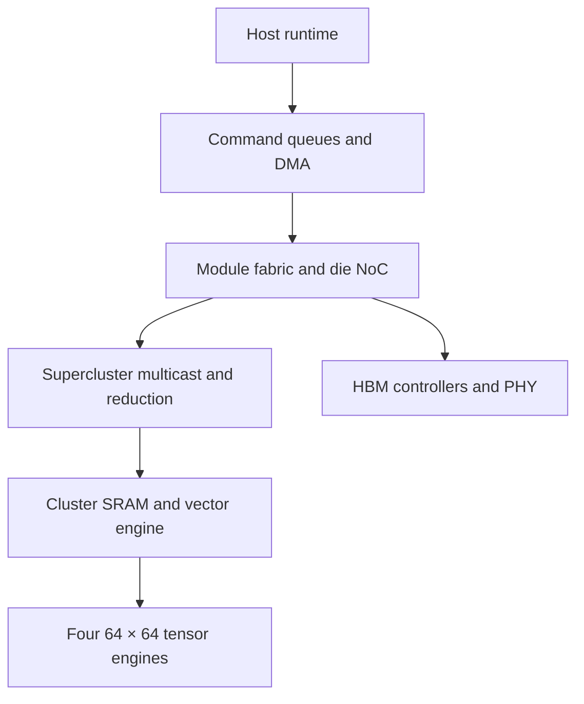

# AIM architecture: design target, not a taped-out specification

## Executive sizing

A **complete AIM device** is four liquid-cooled multi-chip modules, each containing four compute chiplets and four HBM4 stacks, connected by a coherent package-to-package fabric on one baseboard. This definition matters: 16 HBM stacks around one interposer would be an unsupported packaging assumption. Memory is physically distributed and exposed as one address space; remote accesses cost more. The reference RTL models only one small cluster and a generic switch, not the coherent baseboard.

| Hierarchy | Full count | Local functions |
|---|---:|---|
| Complete device | 1 | Four modules, 16 dies, 16 HBM stacks |
| Module | 4 | Four dies, four stacks, fabric bridge |
| Die | 16 | Two superclusters, L2, NoC and HBM access |
| Supercluster | 32 | Four clusters, reduction and multicast tree |
| Cluster | 128 | Four tensor engines, vector engine, 256 KiB SRAM |
| Tensor engine | 512 | Logical 64×64 multiply-accumulate array |
| PE | 2,097,152 | One FP8 MAC/cycle target, two FLOPs/MAC |

Clock: 2.4 GHz logic target on a prospective ~3 nm compute process. Physical closure, voltage, clock tree, I/O process, and thermal measurements are required; this frequency is unverified. 512 × 4096 × 2 × 2.4e9 = **10.066 PFLOP/s dense FP8 theoretical peak**. 16-bit formats provisionally operate at half the MAC rate; INT4 at twice. These ratios require distinct silicon datapaths and are **not implemented** in this version of RTL. Sparse speedups are not counted.

| Precision | Theoretical architectural peak | Unit |
|---|---:|---|
| FP16/BF16 | 5.033 | PFLOP/s |
| FP8 E4M3/E5M2 | 10.066 | PFLOP/s |
| INT8 | 10.066 | POP/s |
| INT4 | 20.133 | POP/s |
| Experimental FP10 E2M7 | 5.033 (assumed) | PFLOP/s |

The 2.4 GHz implementation gate is severe: if it closes at 1.6 GHz, FP8 peak is 6.71 PFLOP/s. An honest redesign would require 50% more lanes, extra chiplets, or a lower precision target. The model never redefines the 10 PFLOPS claim as sparsity-accelerated throughput.

## Dataflow and control

Full ISA proposal: `DMA_LOAD`, `DMA_STORE`, `GEMM`, `VECTOR`, `REDUCE`, `SEND`, `BARRIER`, `WAIT`, `QUANTIZE`, `FORMAT`, `SPARSE_GEMM`, `LAUNCH_KERNEL`. Each command has an asynchronous completion tag and explicit dependencies. Python supports GEMM, vector, reduction, DMA, SEND, BARRIER and simple ASYNC/WAIT; RTL decoder implements GEMM/VECTOR/DMA/BARRIER pulse issue only. The current RTL INT8 engine consumes a row/column outer-product slice each cycle and accumulates signed INT32 with wraparound. FP and systolic wavefronts are future datapaths; no claim of full ISA compatibility today.

Vector lanes handle normalization, RoPE, softmax max/sum, SwiGLU, routing, sampling and quantization. A future cluster vector block needs reciprocal, exp approximation, deterministic reductions and mixed precision, with error budgets for each operator. The included RTL supports saturated add, ReLU, max and passthrough.

## Memory hierarchy

16 × 36 GB HBM4 = **576 GB physical stack capacity**; the device reserves 64 GB for firmware, metadata, bad-page remapping, checkpoint/workspace partitions and routing buffers, exposing **512 GB addressable accelerator memory** in the architecture. This 64 GB reserve is a design policy, not HBM ECC overhead. 36 GB production HBM4 is publicly documented by Micron; use an assumed **2.8 TB/s/stack** for a target of **44.8 TB/s peak** device bandwidth. Effective sustained bandwidth must be measured. At illustrative 70% link efficiency, usable bandwidth is 31.36 TB/s. Four packages × four HBM stacks each permits 144 GB physical per module, 128 GB user budget. 512 GB unified addressing requires coherent translation and remote access handling; not in RTL.

64 MiB aggregate on-chip SRAM: 128 cluster scratchpads × 256 KiB = 32 MiB, plus 16 die L2 × 2 MiB = 32 MiB. Registers are architecturally distinct and excluded from the 64 MiB. Each cluster should use banked SRAM, ECC, two-sided double buffers, a prefetch DMA, and independent read/write paths. The RTL SRAM is a small single-port functional component; no HBM controller/PHY or ECC exists. SRAM aggregate bandwidth target: four 64×64 FP8 operand arrays consume 2 × 64 × 4 × 2.4 GHz = 1.23 TB/s per cluster before reuse (157 TB/s aggregate), requiring banked local operand broadcast; it cannot be sourced directly from HBM. Actual SRAM banking/ports need physical design.

For GEMM (M,N,K), external compulsory bytes, neglecting cache conflicts and write-allocate: `M*K*a_bytes + K*N*b_bytes + M*N*c_bytes`. FLOPs: `2*M*N*K`. At 10.066 PFLOP/s / 44.8 TB/s the ideal HBM ridge is **225 FLOP/byte**; with 70% external efficiency it becomes 321 FLOP/byte. E.g. large FP8 GEMM 4096³ has intensity ~1365 FLOP/byte (assuming one byte A and B, four byte C): potentially compute-bound; a batch-one FP8 decode matrix-vector is near 2 FLOP/byte: memory-bound. Effective throughput is `min(compute_peak × achieved_utilization, bytes_per_s × achieved_intensity)`; a static peak does not imply sustained utilization.

KV cache: total bytes approximately `2 × layers × sequence_length × kv_heads × head_dim × element_bytes × batch`; attention reads grow with sequence length. Support paged KV blocks, GQA, page table gather and write coalescing. Exact KV traffic depends on attention algorithm, head sharing and context length. Attention prefill tiles Q/K/V into SRAM, keeps online softmax max/sum and FP32 accumulation locally, then writes output once. RMSNorm, RoPE and QKV launch fusion avoid intermediate HBM round trips. Training must additionally provision activations, gradients and optimizer states; 512 GB capacity is not equivalent to 512 GB usable for weights.

## NoC and communication

Within each die: proposed bidirectional 2D mesh of clusters with 32-byte/cycle per directed link at 2.4 GHz (76.8 GB/s/link ideal). A separate multicast tree broadcasts weights/activations; a reduction tree carries partial sums. Across dies/modules: non-blocking schedule preferred; **2 TB/s aggregate bisection target** across the four modules is an aspirational PHY/package requirement and implies substantial SerDes power. Remote HBM traffic competes with collectives. `mesh_traffic` implements deterministic XY route link loads and a serialization congestion bound; it does not model arbitration, credit depth, wire delay or multicast hardware. RTL switch is a two-way backpressured arbitration primitive, not a full mesh router.

For P devices, ideal ring AllReduce traffic per device is `2(P−1)/P × message_bytes`, excluding latency; AllGather and ReduceScatter each require `(P−1)/P × message_bytes`. All-to-All has `(P−1)/P × total_sender_bytes` per sender under uniform routing; hotspots change completion time. For 8 AIM devices and 8 GB gradients at a hypothetical 1 TB/s effective per-device collective link, ideal AllReduce takes at least 14 ms; at 100 GB/s at least 140 ms. Tensor/pipeline/data/expert parallelism must choose partition sizes that amortize this. Network link exists only as a model, not transceivers or silicon PHY.

## MoE and training

Router: FP32/FP16 top-k gating, prefix-count token buckets, deterministic capacity handling, scatter to local experts, all-to-all for remote experts, grouped GEMM, inverse scatter, weighted reduce. Keep popular expert weights resident when `resident_bytes <= available_HBM` and expected reused weight bytes exceed transfer cost; cold experts can stream but 70B FP8 expert weights take ~2.23 ms to fetch at 31.36 TB/s effective **device-wide** bandwidth under ideal isolation, longer if remote. Load balancing needs bounded queue depth and congestion instrumentation. Token dispatch fabric and expert caches remain designs only.

Prefill high arithmetic intensity can approach compute limitations; batch-one decoding is HBM dominated; training adds gradient and optimizer traffic and cross-device reductions. `benchmarks/run.py` prints *optimistic lower bound* decode token upper bounds without KV, synchronization or software overhead. It deliberately refuses to manufacture prefill or training tokens/sec from parameter count alone.
